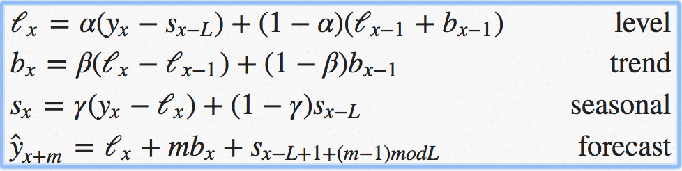

# Holt Winters Predictive Methods

### Abstract
>As part of our desire to improve the operating model through application of AIops, team wants to provide a predictive indicator to answer the question: Do we have enough for Peak? One of the methods, team wants to experiment with is Holt Winters as it is supported within InfluxQL

- https://docs.influxdata.com/influxdb/v1.6/query_language/functions/#holt-winters

### The Experiment
```
SELECT HOLT_WINTERS_WITH_FIT("max_cpu", eighty_percent) FROM "k8-influxdb" WHERE time >= PEAK SEASON
```

### Triple Exponential Smoothing Forecasting a.k.a Holt-Winters Method
>In 1957 an MIT and University of Chicago graduate, professor Charles C Holt (1921-2010) was working at CMU (then known as CIT) on forecasting trends in production, inventories and labor force. It appears that Holt and Brown worked independently and knew not of each-other’s work. Holt published a paper “Forecasting trends and seasonals by exponentially weighted moving averages” (Office of Naval Research Research Memorandum No. 52, Carnegie Institute of Technology) describing double exponential smoothing. Three years later, in 1960, a student of Holts (?) Peter R. Winters improved the algorithm by adding seasonality and published Forecasting sales by exponentially weighted moving averages (Management Science 6, 324–342), citing Dr. Holt’s 1957 paper as earlier work on the same subject. This algorithm became known as triple exponential smoothing or the Holt-Winters method, the latter probably because it was described in a 1960 Prentice-Hall book "Planning Production, Inventories, and Work Force" by Holt, Modigliani, Muth, Simon, Bonini and Winters - good luck finding a copy!

- https://grisha.org/blog/2016/01/29/triple-exponential-smoothing-forecasting/

### The formulae
>The idea behind triple exponential smoothing is to apply exponential smoothing to the seasonal components in addition to level and trend. The smoothing is applied across seasons, e.g. the seasonal component of the 3rd point into the season would be exponentially smoothed with the the one from the 3rd point of last season, 3rd point two seasons ago, etc. In math notation we now have four equations (see footnote):



### HOLT_WINTERS() in python
```python

def initial_trend(series, slen):
    sum = 0.0
    for i in range(slen):
        sum += float(series[i+slen] - series[i]) / slen
    return sum / slen
    
def initial_seasonal_components(series, slen):
    seasonals = {}
    season_averages = []
    n_seasons = int(len(series)/slen)
    # compute season averages
    for j in range(n_seasons):
        season_averages.append(sum(series[slen*j:slen*j+slen])/float(slen))
    # compute initial values
    for i in range(slen):
        sum_of_vals_over_avg = 0.0
        for j in range(n_seasons):
            sum_of_vals_over_avg += series[slen*j+i]-season_averages[j]
        seasonals[i] = sum_of_vals_over_avg/n_seasons
    return seasonals
    
def triple_exponential_smoothing(series, slen, alpha, beta, gamma, n_preds):
    result = []
    seasonals = initial_seasonal_components(series, slen)
    for i in range(len(series)+n_preds):
        if i == 0: # initial values
            smooth = series[0]
            trend = initial_trend(series, slen)
            result.append(series[0])
            continue
        if i >= len(series): # we are forecasting
            m = i - len(series) + 1
            result.append((smooth + m*trend) + seasonals[i%slen])
        else:
            val = series[i]
            last_smooth, smooth = smooth, alpha*(val-seasonals[i%slen]) + (1-alpha)*(smooth+trend)
            trend = beta * (smooth-last_smooth) + (1-beta)*trend
            seasonals[i%slen] = gamma*(val-smooth) + (1-gamma)*seasonals[i%slen]
            result.append(smooth+trend+seasonals[i%slen])
    return result
```
